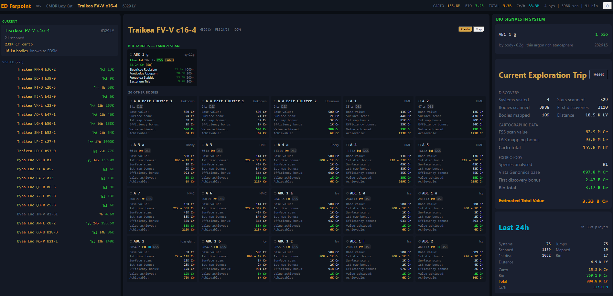
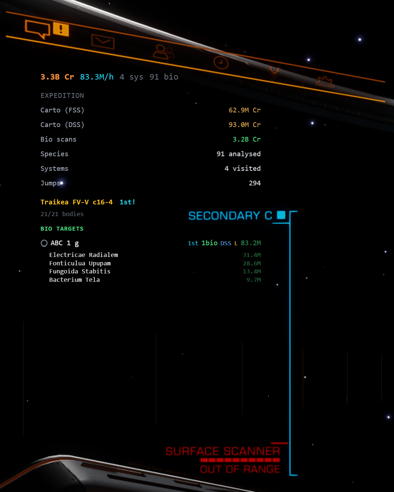

# ED Farpoint

A companion app for **Elite Dangerous** explorers and exobiologists. Reads your game journals in real-time, tracks your discoveries, predicts bio species, and helps you maximize your exploration profits.

Built with Tauri 2 (Rust) + Svelte 5 + UnoCSS.

## Screenshots

<!-- Main app window -->


<!-- Main app map -->


<!-- In-game overlay -->


## Features

### Discovery & Scanning
- Real-time journal parsing — sees what you see, as you see it
- Current system view with all scanned bodies, signals, and estimated values
- First discovery detection for systems and individual bodies
- FSS progress tracking

### Exobiology
- Species prediction using Canonn dataset — know what to expect before you land
- Bio tracker with sample progress (3-sample workflow with clonal range distances)
- Live haversine distance to previous scan sites — tells you when you're far enough to scan
- Sound alerts when clonal range threshold is reached
- Per-species value with first-discovery multiplier (5x)

### Route Planning
- Live route display from NavRoute.json with remaining jumps and distance
- Scoopable star highlighting (KGB FOAM)
- Neutron star identification
- EDSM discoverer lookup for upcoming systems — see who's been there before you (or "???" if undiscovered)

### Stats & Value Tracking
- **Trip stats** — everything since your last dock: systems, bodies, distance, carto/bio value breakdown
- **Last 24h stats** — play time and earnings in a rolling 24-hour window
- **Lifetime stats** — all-time career numbers with rarest species tracking
- **Cr/h rate** — credits per hour based on active play time (AFK time excluded)
- **Fleet carrier values** — optional toggle showing carrier payout (65.6% of base)

### Overlay
- Transparent in-game overlay window with context-aware display
- On planet surface: bio tracker with species, samples, and live distance
- In system: bio targets, carto targets, first discovery tags
- Route info with next systems, star classes, and EDSM discoverers
- Draggable, resizable, configurable opacity

### Performance
- Journal cache for near-instant startup on return visits
- Incremental journal reading — only processes new events since last session
- Background lifetime stats processing with chunked rendering

### Other
- EDSM integration for body discoverer info
- Remote access server (HTTP + WebSocket) for tablet/phone companion displays
- Auto-updater from GitHub releases
- Custom icon

## Installation

Download the latest installer from [Releases](https://github.com/amezh/EDFarpoint/releases/latest).

- **NSIS installer** (.exe) — recommended, installs to Program Files
- **MSI installer** (.msi) — alternative Windows installer

## Development

```bash
cd ed-companion
pnpm install
pnpm tauri dev      # Dev mode with hot reload
```

### Requirements
- Node.js 22+
- pnpm 9+
- Rust (stable toolchain)
- Windows 10/11 (for journal file access)

### Building
```bash
pnpm tauri build
```

## Configuration

Settings are accessible via the gear icon in the top-right corner:

- **Journal directory** — auto-detected, or set manually
- **EDSM API key** — for discoverer lookups
- **GitHub token** — for auto-update from private releases
- **Bio value threshold** — minimum value to highlight species
- **Carto POI threshold** — minimum value for cartographic points of interest
- **Overlay** — toggle, opacity, always-on-top
- **Fleet carrier values** — show/hide carrier payout calculations
- **Remote server** — enable HTTP/WS server for external access

## Tech Stack

- **Backend**: Tauri 2 + Rust (journal watcher, EDSM client, bio predictor, axum server)
- **Frontend**: Svelte 5 with runes, UnoCSS
- **Data**: Canonn bio dataset, Vista Genomics price tables, official ED value formulae

## License

MIT
